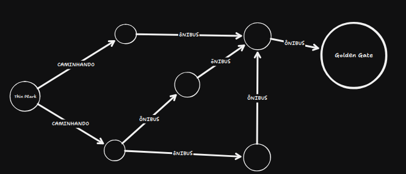
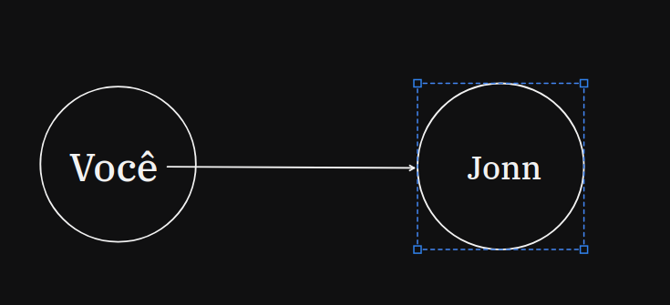
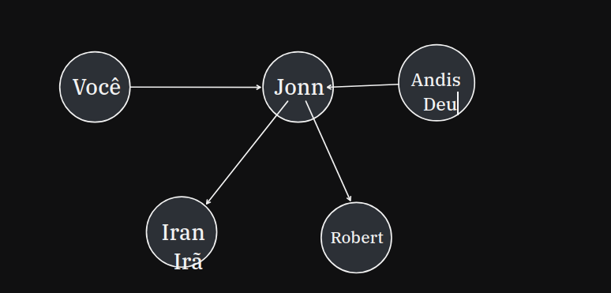
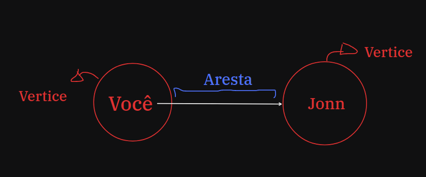
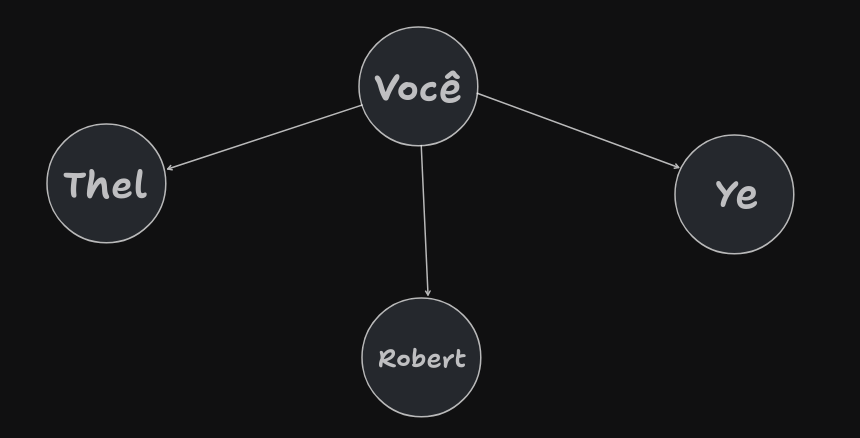

# Pesquisa em Largura(Breadth-first-search) BFS

## Introdução aos grafos

Grafos **não** envolvem eixos, tanto x,y ou x,y,z ele não representa espaço ou direção, mas sim **relações**.

## Uma pequena viagem

Agora, do nada! Você está em *São Francismo* e deseja chegar a ponte *Golden Gate*

Para descobrir como ir de Twin Peark Park até a *Golden Gate* existem Duas etpadas:

- **Modela o problema** utilizando **grafos**;
- Resolva o problema usando o algoritmo de pesquisa em Largura.

## O que é um grafo?

É um conjunto de conexões . Por exemplo, suponha você e seus amigos estejam jogando um jogo e que você deve a Jonn.

Você deve a Jonn, ele deve Iran e ao Robert e Andis deve a Jonn.

As relações chamamos de Arestas e os "objetos" de relação de verteces.

# Pesquida em Largura

Ela responde duas perguntas:

- Existe um caminho do ponto A até o B?
- Qual o menor caminho do ponto A até o B?

O funcionamento é bem simples!
Tenha as conexões de amigos, caso queira encontrar um amigo que seja desenvolvedor, por exemplo:

Agora vá até eles pergunta um por um se são desenvolvedores